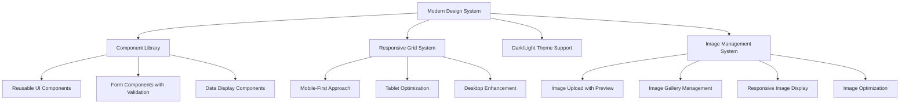
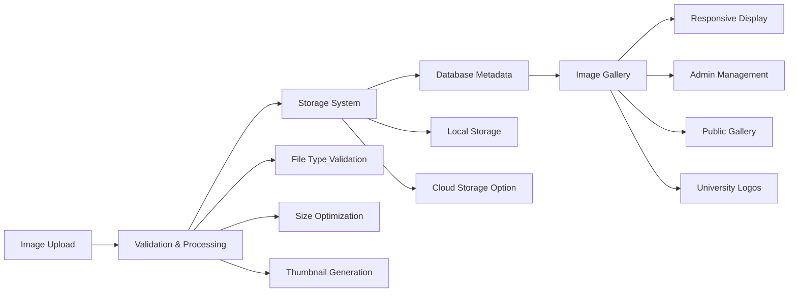
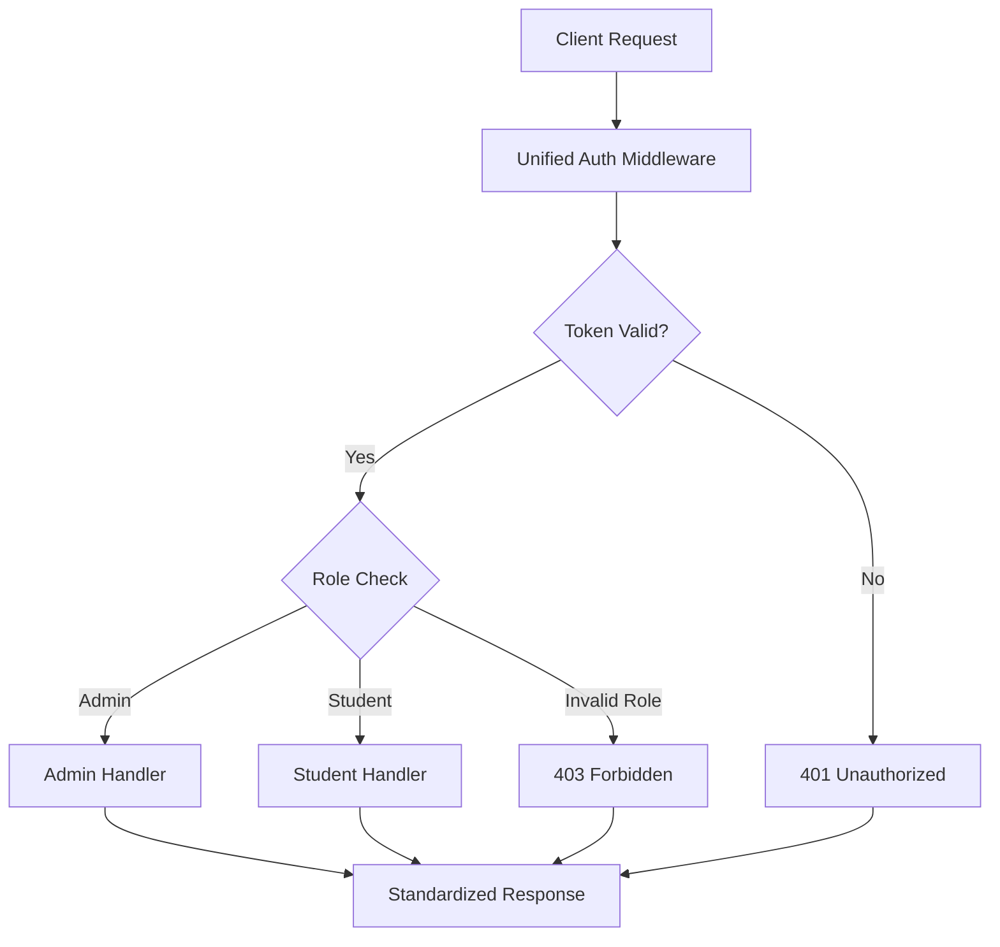
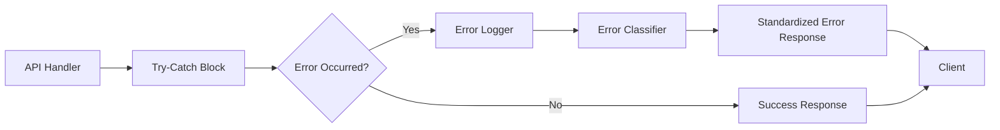

# Design Document

## Overview

This design addresses critical issues in the Next.js university application by implementing a comprehensive fix strategy that prioritizes security, consistency, and maintainability with a modern, responsive user interface. The solution focuses on standardizing authentication middleware, completing missing API endpoints, implementing robust error handling, and enhancing form validation across the entire application with contemporary design patterns.

The design follows modern Next.js best practices, incorporating lessons learned from recent security vulnerabilities (CVE-2025-29927) and industry standards for API design. The approach emphasizes a single source of truth for validation schemas, consistent response formats, defensive programming practices, and a modern UI/UX that includes comprehensive image management capabilities.

## Architecture

### Modern UI/UX Architecture

The application will implement a modern, responsive design system with the following characteristics:



**Key Modern Design Features**:
- **Clean, Minimalist Interface**: Reduced visual clutter with focus on content
- **Consistent Spacing System**: 8px grid system for consistent spacing
- **Modern Typography**: Clear hierarchy with readable fonts
- **Intuitive Navigation**: Breadcrumbs, clear menu structure, and logical flow
- **Responsive Design**: Mobile-first approach with seamless desktop experience
- **Accessibility**: WCAG 2.1 AA compliance with proper contrast and keyboard navigation
- **Loading States**: Skeleton screens and smooth transitions
- **Error States**: User-friendly error messages with clear recovery actions

### Image Management Architecture

A comprehensive image management system will be implemented to handle all image operations:



**Image System Features**:
- **Multi-format Support**: JPEG, PNG, WebP with automatic optimization
- **Responsive Images**: Multiple sizes generated automatically
- **Drag & Drop Upload**: Modern file upload interface
- **Image Gallery**: Grid-based gallery with search and filtering
- **Thumbnail Generation**: Automatic thumbnail creation for performance
- **Image Metadata**: Title, alt text, categories, and tags
- **Usage Tracking**: Track where images are used throughout the system

### Authentication Architecture

The current application has multiple authentication implementations that create inconsistencies and potential security vulnerabilities. The design consolidates these into a unified approach:



### API Response Architecture

All API endpoints will follow a standardized response format to ensure consistency across the application:

```typescript
interface StandardResponse<T = any> {
  success: boolean;
  message?: string;
  data?: T;
  error?: {
    code: string;
    details?: any;
  };
  meta?: {
    timestamp: string;
    requestId?: string;
    pagination?: PaginationInfo;
  };
}
```

### Error Handling Architecture

The design implements a centralized error handling system that provides consistent error responses and proper logging:



## Components and Interfaces

### Modern UI Component System

**Purpose**: Create a comprehensive, reusable component library with modern design patterns.

**Key Components**:
- `ModernButton`: Consistent button styles with hover states and loading indicators
- `ModernCard`: Clean card components with shadows and rounded corners
- `ModernForm`: Form components with floating labels and inline validation
- `ModernTable`: Responsive tables with sorting, filtering, and pagination
- `ModernModal`: Accessible modals with backdrop blur and smooth animations
- `ImageUploader`: Drag-and-drop image upload with preview and progress
- `ImageGallery`: Grid-based image gallery with lightbox functionality
- `LoadingSpinner`: Modern loading indicators and skeleton screens
- `ErrorBoundary`: Graceful error handling with recovery options

**Design System Specifications**:
```css
/* Color Palette */
:root {
  --primary: #3b82f6;
  --primary-dark: #1d4ed8;
  --secondary: #64748b;
  --success: #10b981;
  --warning: #f59e0b;
  --error: #ef4444;
  --background: #ffffff;
  --surface: #f8fafc;
  --text-primary: #1e293b;
  --text-secondary: #64748b;
  --border: #e2e8f0;
  --shadow: 0 1px 3px 0 rgb(0 0 0 / 0.1);
}

/* Typography Scale */
.text-xs { font-size: 0.75rem; }
.text-sm { font-size: 0.875rem; }
.text-base { font-size: 1rem; }
.text-lg { font-size: 1.125rem; }
.text-xl { font-size: 1.25rem; }
.text-2xl { font-size: 1.5rem; }
.text-3xl { font-size: 1.875rem; }

/* Spacing System (8px grid) */
.space-1 { margin: 0.25rem; }
.space-2 { margin: 0.5rem; }
.space-3 { margin: 0.75rem; }
.space-4 { margin: 1rem; }
.space-6 { margin: 1.5rem; }
.space-8 { margin: 2rem; }
```

### Image Management System

**Purpose**: Implement a comprehensive image management system with modern upload, organization, and display capabilities.

**Key Components**:
- `ImageUploader`: Modern drag-and-drop interface with multiple file support
- `ImageGallery`: Grid-based gallery with search, filter, and sort capabilities
- `ImageEditor`: Basic editing tools (crop, resize, rotate)
- `ImageOptimizer`: Automatic compression and format conversion
- `ImageMetadata`: Title, alt text, categories, and usage tracking

**Image Upload Interface**:
```typescript
interface ImageUploadComponent {
  dragAndDrop: boolean;
  multipleFiles: boolean;
  previewThumbnails: boolean;
  progressIndicator: boolean;
  fileTypeValidation: string[];
  maxFileSize: number;
  onUploadComplete: (images: UploadedImage[]) => void;
  onUploadError: (error: UploadError) => void;
}
```

**Image Gallery Features**:
- **Grid Layout**: Responsive masonry or grid layout
- **Search & Filter**: Search by name, filter by category/tags
- **Bulk Operations**: Select multiple images for batch operations
- **Lightbox View**: Full-screen image viewing with navigation
- **Usage Tracking**: Show where each image is used in the system

### Unified Authentication Middleware

**Purpose**: Replace multiple authentication implementations with a single, secure middleware system.

**Key Components**:
- `UnifiedAuthMiddleware`: Main authentication wrapper
- `TokenValidator`: JWT token validation logic
- `RoleChecker`: Role-based access control
- `SecurityLogger`: Authentication event logging

**Interface**:
```typescript
interface AuthMiddleware {
  withAuth(handler: ApiHandler): ApiHandler;
  withAdminAuth(handler: ApiHandler): ApiHandler;
  withStudentAuth(handler: ApiHandler): ApiHandler;
  verifyToken(token: string): Promise<UserPayload | null>;
  checkRole(user: UserPayload, requiredRole: string): boolean;
}
```

### API Endpoint Completion System

**Purpose**: Implement missing API endpoints with consistent patterns and proper error handling.

**Missing Endpoints to Implement**:
- `/api/admin/universities/index.js` - Complete universities listing for admin
- Enhanced `/api/admin/users/[id].js` - Full CRUD operations with validation
- Updated `/api/admin/applications/[id].js` - Notes field support

**Standard Endpoint Pattern**:
```typescript
interface ApiEndpoint {
  GET?: (req: NextApiRequest, res: NextApiResponse) => Promise<void>;
  POST?: (req: NextApiRequest, res: NextApiResponse) => Promise<void>;
  PUT?: (req: NextApiRequest, res: NextApiResponse) => Promise<void>;
  DELETE?: (req: NextApiRequest, res: NextApiResponse) => Promise<void>;
}
```

### Form Validation System

**Purpose**: Implement comprehensive client and server-side validation using Zod schemas.

**Key Components**:
- `ValidationSchemas`: Zod schemas for all forms
- `ClientValidator`: Client-side validation hooks
- `ServerValidator`: Server-side validation middleware
- `ErrorFormatter`: Consistent error message formatting

**Validation Schema Structure**:
```typescript
interface ValidationSchema {
  userSchema: z.ZodSchema;
  universitySchema: z.ZodSchema;
  applicationSchema: z.ZodSchema;
  loginSchema: z.ZodSchema;
}
```

### Error Handling System

**Purpose**: Provide consistent error handling across all API endpoints and pages.

**Key Components**:
- `ErrorHandler`: Central error processing
- `ErrorLogger`: Structured error logging
- `ErrorResponse`: Standardized error response formatter
- `ClientErrorBoundary`: React error boundary for client-side errors

### Configuration Management System

**Purpose**: Replace hardcoded values with configurable environment variables.

**Key Components**:
- `ConfigValidator`: Environment variable validation
- `ConfigDefaults`: Default configuration values
- `ConfigLoader`: Configuration loading and validation

## Data Models

### Enhanced Image Model

The Image model will support comprehensive metadata and organization:

```typescript
interface Image {
  _id: ObjectId;
  filename: string;
  originalName: string;
  mimeType: string;
  size: number;
  dimensions: {
    width: number;
    height: number;
  };
  thumbnails: {
    small: string; // 150x150
    medium: string; // 300x300
    large: string; // 600x600
  };
  metadata: {
    title?: string;
    altText?: string;
    description?: string;
    category: 'university-logo' | 'hero-image' | 'gallery' | 'document' | 'other';
    tags: string[];
  };
  usage: {
    usedIn: string[]; // Array of page/component references
    lastUsed: Date;
    usageCount: number;
  };
  uploadedBy: ObjectId;
  createdAt: Date;
  updatedAt: Date;
  isActive: boolean;
}
```

### Enhanced User Model

The existing User model will be enhanced to support better validation and consistency:

```typescript
interface User {
  _id: ObjectId;
  name: string;
  email: string;
  password: string; // hashed
  role: 'admin' | 'student';
  phone?: string;
  profileImage?: ObjectId; // Reference to Image model
  preferences: {
    theme: 'light' | 'dark' | 'system';
    language: string;
    notifications: boolean;
  };
  createdAt: Date;
  updatedAt: Date;
  lastLogin?: Date;
  isActive: boolean;
}
```

### Enhanced University Model

The University model will be updated to support modern image management:

```typescript
interface University {
  _id: ObjectId;
  name: string;
  nameAr?: string; // Arabic name
  city: string;
  cityAr?: string;
  type: 'public' | 'private' | 'foundation';
  description?: string;
  descriptionAr?: string;
  images: {
    logo: ObjectId; // Reference to Image model
    heroImage?: ObjectId;
    gallery: ObjectId[]; // Array of image references
  };
  contact: {
    website?: string;
    email?: string;
    phone?: string;
    address?: string;
  };
  programs: string[];
  fees: {
    tuition?: number;
    application?: number;
    currency: string;
  };
  requirements: {
    gpa?: number;
    languageTest?: string;
    documents: string[];
  };
  isActive: boolean;
  featured: boolean;
  createdAt: Date;
  updatedAt: Date;
}
```

### Enhanced User Model

The existing User model will be enhanced to support better validation and consistency:

```typescript
interface User {
  _id: ObjectId;
  name: string;
  email: string;
  password: string; // hashed
  role: 'admin' | 'student';
  phone?: string;
  createdAt: Date;
  updatedAt: Date;
  lastLogin?: Date;
  isActive: boolean;
}
```

### Enhanced Application Model

The Application model will be updated to support admin notes and better tracking:

```typescript
interface Application {
  _id: ObjectId;
  studentId: ObjectId;
  universityId: ObjectId;
  universityName: string; // fallback for deleted universities
  status: 'pending' | 'approved' | 'rejected' | 'under_review';
  notes: string; // admin notes
  adminNotes: AdminNote[]; // structured admin notes with timestamps
  createdAt: Date;
  updatedAt: Date;
  lastModifiedBy?: ObjectId; // admin who last modified
}

interface AdminNote {
  adminId: ObjectId;
  note: string;
  timestamp: Date;
  type: 'status_change' | 'general' | 'follow_up';
}
```

### Response Format Models

Standardized response interfaces for consistent API responses:

```typescript
interface SuccessResponse<T> {
  success: true;
  message?: string;
  data: T;
  meta?: ResponseMeta;
}

interface ErrorResponse {
  success: false;
  message: string;
  error: {
    code: string;
    details?: any;
  };
  meta?: ResponseMeta;
}

interface ResponseMeta {
  timestamp: string;
  requestId?: string;
  pagination?: {
    page: number;
    limit: number;
    total: number;
    totalPages: number;
  };
}
```

## Correctness Properties

*A property is a characteristic or behavior that should hold true across all valid executions of a system—essentially, a formal statement about what the system should do. Properties serve as the bridge between human-readable specifications and machine-verifiable correctness guarantees.*

### Property 1: API Response Format Consistency
*For any* API endpoint in the system, all responses should follow the standardized JSON format with success/error indicators, appropriate HTTP status codes, and consistent field naming conventions
**Validates: Requirements 1.4, 9.1, 9.2, 9.3, 9.4, 9.5**

### Property 2: Authentication Middleware Consistency  
*For any* protected API route, the authentication mechanism should be consistent, returning the same error format for authentication failures and attaching user information in the same format
**Validates: Requirements 2.1, 2.2, 2.3, 2.4, 10.1**

### Property 3: CRUD Operations Completeness
*For any* admin management endpoint (users, universities, applications), all required HTTP methods (GET, POST, PUT, DELETE) should be supported with proper validation and error handling
**Validates: Requirements 1.2**

### Property 4: Application Notes Management
*For any* application update operation, the notes field should be properly saved, retrieved, and displayed with complete information including timestamps and admin details
**Validates: Requirements 3.1, 3.2, 3.3, 3.4, 3.5**

### Property 5: Form Validation Dual-Side
*For any* form submission, validation should occur on both client and server sides, with specific error messages for invalid fields and prevention of invalid data submission
**Validates: Requirements 5.1, 5.2, 5.3, 5.4, 5.5**

### Property 6: Error Handling Consistency
*For any* error condition (API errors, database failures, authentication failures), the system should return structured error responses with appropriate status codes and user-friendly messages
**Validates: Requirements 4.1, 4.2, 4.3, 4.5**

### Property 7: Modern Image Management Functionality
*For any* image operation (upload, display, delete, organize), the system should provide a modern interface with drag-and-drop upload, responsive thumbnails, search and filtering capabilities, and proper metadata management
**Validates: Requirements 6.1, 6.2, 6.3, 6.4, 6.5**

### Property 8: Responsive Design Consistency
*For any* page or component, the interface should be fully responsive across mobile, tablet, and desktop devices with consistent spacing, typography, and interaction patterns
**Validates: Modern UI/UX requirements**

### Property 9: Null Safety and Graceful Degradation
*For any* data that may be missing or null, the system should display appropriate placeholder messages, empty states with guidance, and error states with retry options instead of crashing
**Validates: Requirements 7.1, 7.2, 7.3, 7.4, 7.5**

### Property 10: Configuration Management
*For any* configuration value, the system should use environment variables or configuration files with proper defaults and validation at startup
**Validates: Requirements 8.3, 8.4**

### Property 11: Security Implementation
*For any* security-sensitive operation, the system should implement proper input sanitization, authorization checks, security logging, and rate limiting for authentication attempts
**Validates: Requirements 10.2, 10.3, 10.4, 10.5**

## Error Handling

The error handling system implements a multi-layered approach to ensure robust error management across the application:

### Error Classification

**Client Errors (4xx)**:
- 400 Bad Request: Invalid input data or malformed requests
- 401 Unauthorized: Missing or invalid authentication tokens
- 403 Forbidden: Valid authentication but insufficient permissions
- 404 Not Found: Requested resources do not exist
- 422 Unprocessable Entity: Valid request format but semantic errors

**Server Errors (5xx)**:
- 500 Internal Server Error: Unexpected server-side errors
- 502 Bad Gateway: Database connection or external service failures
- 503 Service Unavailable: Temporary service unavailability

### Error Response Structure

All errors follow the standardized response format:

```typescript
interface ErrorResponse {
  success: false;
  message: string;
  error: {
    code: string;
    details?: ValidationError[] | string;
  };
  meta: {
    timestamp: string;
    requestId?: string;
  };
}
```

### Error Logging Strategy

**Security Events**: Authentication failures, authorization violations, suspicious activities
**Application Errors**: Database failures, API errors, validation failures
**Performance Issues**: Slow queries, timeout errors, resource exhaustion

### Client-Side Error Handling

**Error Boundaries**: React error boundaries to catch and display user-friendly error messages
**Form Validation**: Real-time validation with field-specific error messages
**Network Errors**: Retry mechanisms and offline state handling
**Internationalization**: Error messages in appropriate user language

## Testing Strategy

The testing strategy employs a dual approach combining unit tests for specific scenarios and property-based tests for comprehensive coverage:

### Unit Testing Approach

**Specific Examples**: Test concrete scenarios like successful login, form submission with valid data
**Edge Cases**: Test boundary conditions such as empty forms, maximum field lengths, special characters
**Error Conditions**: Test specific error scenarios like invalid credentials, network failures
**Integration Points**: Test component interactions, API endpoint integration, database operations

**Focus Areas**:
- Authentication flow with valid/invalid credentials
- Form validation with specific invalid inputs
- API endpoint responses for known scenarios
- Database operations with specific test data

### Property-Based Testing Approach

**Library**: Use `fast-check` for JavaScript/TypeScript property-based testing
**Configuration**: Minimum 100 iterations per property test to ensure comprehensive coverage
**Test Tagging**: Each property test tagged with format: **Feature: page-fixes, Property {number}: {property_text}**

### Property Test Implementation**:
- **Property 1**: Generate random API endpoints and verify response format consistency
- **Property 2**: Generate random authentication scenarios and verify middleware consistency
- **Property 3**: Generate random CRUD operations and verify completeness
- **Property 4**: Generate random application updates and verify notes management
- **Property 5**: Generate random form data and verify dual-side validation
- **Property 6**: Generate random error conditions and verify error handling consistency
- **Property 7**: Generate random image operations and verify modern management functionality
- **Property 8**: Generate random responsive design scenarios and verify consistency
- **Property 9**: Generate random null/missing data scenarios and verify graceful handling
- **Property 10**: Generate random configuration scenarios and verify management
- **Property 11**: Generate random security scenarios and verify implementation

### Testing Coverage Requirements

**API Endpoints**: All endpoints must have both unit tests for specific scenarios and property tests for general behavior
**Authentication**: Both successful and failed authentication scenarios across all protected routes
**Form Validation**: Both client-side and server-side validation with various input combinations
**Error Handling**: All error types and response formats across different failure scenarios
**Security**: Authentication, authorization, input sanitization, and rate limiting scenarios

### Test Environment Setup

**Database**: Use test database with controlled test data
**Authentication**: Mock JWT tokens for different user roles and scenarios
**File Operations**: Mock file system operations for image management tests
**Network**: Mock external API calls and network failures
**Configuration**: Test with various environment variable configurations

The comprehensive testing approach ensures that both specific use cases work correctly (unit tests) and that the system behaves consistently across all possible inputs (property tests), providing confidence in the system's reliability and correctness.

## Modern UI Implementation Strategy

### Component Architecture

The modern UI system follows a component-driven architecture with the following structure:

```
src/components/
├── ui/                    # Reusable UI components
│   ├── ModernButton.js    # Button component with variants
│   ├── ModernCard.js      # Card component with shadows
│   ├── ModernForm.js      # Form components with validation
│   ├── ModernTable.js     # Responsive table component
│   ├── ModernModal.js     # Modal with backdrop blur
│   ├── ImageUploader.js   # Drag-and-drop image upload
│   ├── ImageGallery.js    # Grid-based image gallery
│   ├── LoadingSpinner.js  # Loading states and skeletons
│   └── ErrorBoundary.js   # Error handling component
├── layout/                # Layout components
│   ├── AdminLayout.js     # Admin panel layout
│   ├── StudentLayout.js   # Student dashboard layout
│   └── PublicLayout.js    # Public pages layout
└── features/              # Feature-specific components
    ├── universities/      # University management components
    ├── applications/      # Application management components
    └── users/            # User management components
```

### Design Token System

The design system uses CSS custom properties for consistent theming:

```css
/* Design Tokens */
:root {
  /* Colors */
  --color-primary-50: #eff6ff;
  --color-primary-500: #3b82f6;
  --color-primary-600: #2563eb;
  --color-primary-700: #1d4ed8;
  
  --color-gray-50: #f9fafb;
  --color-gray-100: #f3f4f6;
  --color-gray-500: #6b7280;
  --color-gray-900: #111827;
  
  /* Typography */
  --font-family-sans: 'Inter', system-ui, sans-serif;
  --font-size-xs: 0.75rem;
  --font-size-sm: 0.875rem;
  --font-size-base: 1rem;
  --font-size-lg: 1.125rem;
  --font-size-xl: 1.25rem;
  --font-size-2xl: 1.5rem;
  --font-size-3xl: 1.875rem;
  
  /* Spacing */
  --space-1: 0.25rem;
  --space-2: 0.5rem;
  --space-3: 0.75rem;
  --space-4: 1rem;
  --space-6: 1.5rem;
  --space-8: 2rem;
  --space-12: 3rem;
  --space-16: 4rem;
  
  /* Shadows */
  --shadow-sm: 0 1px 2px 0 rgb(0 0 0 / 0.05);
  --shadow-md: 0 4px 6px -1px rgb(0 0 0 / 0.1);
  --shadow-lg: 0 10px 15px -3px rgb(0 0 0 / 0.1);
  
  /* Border Radius */
  --radius-sm: 0.125rem;
  --radius-md: 0.375rem;
  --radius-lg: 0.5rem;
  --radius-xl: 0.75rem;
}

/* Dark Mode */
[data-theme="dark"] {
  --color-background: #0f172a;
  --color-surface: #1e293b;
  --color-text-primary: #f1f5f9;
  --color-text-secondary: #94a3b8;
  --color-border: #334155;
}
```

### Responsive Design Strategy

The application implements a mobile-first responsive design:

```css
/* Mobile First Breakpoints */
.container {
  width: 100%;
  padding: 0 1rem;
}

/* Tablet */
@media (min-width: 768px) {
  .container {
    max-width: 768px;
    margin: 0 auto;
    padding: 0 2rem;
  }
}

/* Desktop */
@media (min-width: 1024px) {
  .container {
    max-width: 1024px;
  }
}

/* Large Desktop */
@media (min-width: 1280px) {
  .container {
    max-width: 1280px;
  }
}
```

### Image Management Implementation

The image management system provides comprehensive functionality:

**Upload Process**:
1. Client-side validation (file type, size)
2. Drag-and-drop interface with preview
3. Progress tracking during upload
4. Server-side processing and thumbnail generation
5. Metadata extraction and storage
6. Usage tracking initialization

**Storage Strategy**:
- Original images stored in `/public/uploads/images/`
- Thumbnails generated in `/public/uploads/thumbnails/`
- Metadata stored in MongoDB Image collection
- CDN integration ready for production scaling

**Gallery Features**:
- Infinite scroll or pagination
- Search by filename, title, or tags
- Filter by category, date, or usage
- Bulk selection and operations
- Lightbox view with keyboard navigation
- Usage tracking and reference management

This comprehensive design ensures a modern, accessible, and maintainable user interface with robust image management capabilities.